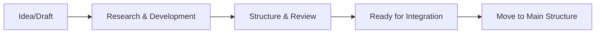

# 🚧 Work-in-Progress (WIP) Content

> **Development Hub for ReFi Barcelona Knowledge Base**

This directory contains content that is actively being developed, reviewed, or refined before being integrated into the main knowledge base structure. All content here is considered **work-in-progress** and may be incomplete, experimental, or under review.

---

## 📁 Directory Structure

```
03-wip/
├── README.md                 # This file - WIP planning and organization
├── articles/                 # Article development workspace
│   ├── article-bioregionalism/   # Bioregional approach articles
│   └── article-cooperative/       # Cooperative structure articles
├── cooperative/              # Cooperative development content
│   ├── membership/               # Membership framework development
│   ├── participation/            # Participation mechanisms
│   └── references/               # Reference materials & research
├── drafts/                   # General drafts and rough content
├── GG24/                     # Gitcoin Grants 24 campaign materials
└── references/               # Research materials and external sources
```

### 📊 **Current Status**: 33 files in development

---

## 🎯 Content Categories

### **📝 Articles** (`articles/`)
**Purpose**: Development of structured articles for publication
- **Bioregionalism articles** - Exploring bioregional approaches to ReFi
- **Cooperative articles** - Documenting cooperative structures and governance
- **Status**: Active development, awaiting review and integration

### **🤝 Cooperative** (`cooperative/`)
**Purpose**: Cooperative framework development and documentation  
- **Membership** - Member onboarding, rights, and responsibilities
- **Participation** - Governance mechanisms and decision-making
- **References** - Research on cooperative models and best practices
- **Status**: Foundational work, needs structure refinement

### **✏️ Drafts** (`drafts/`)
**Purpose**: General drafts, notes, and preliminary content
- Raw ideas and initial explorations
- Content awaiting categorization or development
- **Status**: Various stages, regular review needed

### **💰 GG24** (`GG24/`)
**Purpose**: Gitcoin Grants Round 24 campaign materials
- Campaign content and strategy materials
- Grant application documentation
- **Status**: Campaign-specific, time-sensitive content

### **📚 References** (`references/`)
**Purpose**: Research materials and external documentation
- Background research and source materials
- Reference documents for content development
- **Status**: Supporting materials for active development

---

## 🔄 Workflow Process

### **1. Content Development Stages**



### **2. Content Review Criteria**
- [ ] **Completeness** - Content is substantially complete
- [ ] **Accuracy** - Information is verified and accurate
- [ ] **Structure** - Proper formatting and organization
- [ ] **Relevance** - Aligns with ReFi Barcelona mission
- [ ] **Integration Ready** - Fits within main knowledge base structure

### **3. Integration Process**
1. **Review** - Content meets quality standards
2. **Categorize** - Determine appropriate main directory
3. **Move** - Transfer to `01-about/`, `02-ecosystem/`, etc.
4. **Update** - Ensure proper linking and navigation
5. **Archive** - Remove from WIP, update tracking

---

## 📋 Current Priorities

### **🔥 High Priority**
- [ ] **Cooperative framework** - Complete membership and governance docs
- [ ] **Bioregional articles** - Finalize bioregional approach documentation
- [ ] **GG24 materials** - Complete campaign content for upcoming round

### **🔄 Medium Priority**  
- [ ] **Reference organization** - Structure research materials better
- [ ] **Article series** - Plan and develop article publication schedule
- [ ] **Content review** - Systematic review of draft materials

### **📝 Planning Tasks**
- [ ] **Content audit** - Review all 33 files for status and priority
- [ ] **Integration pipeline** - Plan movement of ready content to main structure
- [ ] **Quality standards** - Establish clear criteria for content readiness

---

## 🏷️ Content Status Tracking

### **📊 By Category**
| Category | Files | Status | Next Action |
|----------|-------|---------|-------------|
| Articles | ~8 files | Active development | Structure & review |
| Cooperative | ~15 files | Foundation building | Framework completion |
| Drafts | ~5 files | Various stages | Categorization & development |
| GG24 | ~3 files | Campaign active | Content finalization |
| References | ~2 files | Supporting materials | Organization |

### **🎯 Success Metrics**
- **Weekly Goal**: Review and progress 3-5 WIP files
- **Monthly Goal**: Integrate 2-3 completed pieces into main structure
- **Quality Goal**: Maintain high standards for content integration

---

## 📝 Guidelines for Contributors

### **Adding New WIP Content**
1. **Choose appropriate subdirectory** based on content type
2. **Use descriptive filenames** with clear version/date indicators
3. **Add front matter** with status, author, and review notes
4. **Update this README** with new content tracking

### **Working with WIP Content**
- **Status markers** - Use clear indicators (DRAFT, REVIEW, READY)
- **Version control** - Save iterations, note major changes
- **Collaboration** - Tag reviewers and stakeholders
- **Documentation** - Keep notes on development process

### **Moving Content to Main Structure**
- **Final review** - Ensure content meets integration criteria
- **Proper placement** - Choose correct main directory
- **Update links** - Ensure internal references work
- **Clean removal** - Remove from WIP, update tracking

---

## 🔗 Related Resources

- **Main Knowledge Base**: `../01-about/`, `../02-ecosystem/`, etc.
- **Archive**: `../04-archive/` for historical content
- **Assets**: `../assets/` for images and documents
- **Project Root**: `../../README.md` for overall project documentation

---

## 📅 Last Updated

**Date**: August 2024  
**Files Tracked**: 33 WIP files  
**Active Categories**: 5 main categories  
**Review Status**: Needs systematic audit and prioritization

---

> **💡 Tip**: Regular review of this WIP directory ensures content flows smoothly into the main knowledge base while maintaining quality standards. Use this README as a planning tool and progress tracker.